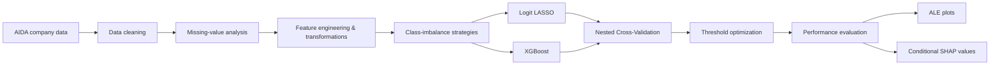

# Corporate Default Prediction in Italian Micro-Enterprises

**Master's Thesis Project — University of Milano-Bicocca**  
**Author:** Federico Perina  
**MSc in Statistical and Economic Sciences — Academic Year 2025/2026**

## Overview

This project investigates **corporate default prediction for Italian manufacturing micro-enterprises**, comparing a traditional statistical approach, **Logit LASSO**, with a more flexible machine-learning model, **XGBoost**.

The main objective is to assess whether XGBoost can improve predictive performance over a regularized logistic regression while preserving a meaningful interpretation of the financial drivers behind each prediction.

The analysis focuses on three key challenges commonly found in credit-risk applications:

- **strong class imbalance**, since default events are rare;
- **complex and incomplete accounting data**, with missing values, outliers and highly skewed distributions;
- the trade-off between **predictive performance and interpretability**.

---

## Research Question

> Can a flexible machine-learning model such as XGBoost improve the prediction of corporate default among Italian micro-enterprises compared with a more interpretable Logit LASSO model?

The comparison is conducted not only in terms of predictive performance, but also by examining how the models use financial information to generate their predictions.

---

## Dataset

The empirical analysis is based on company-level data extracted from **AIDA – Bureau van Dijk / Moody's**, provided through the WebSight Observatory of the University of Milano-Bicocca.

The sample includes Italian manufacturing micro-enterprises and uses:

- **2017 financial and accounting information** as predictors;
- **2019 corporate status** to identify default events.

### Final modelling sample

| Class | Observations | Share |
|---|---:|---:|
| Non-default | 70,328 | 96.5% |
| Default | 2,561 | 3.5% |
| **Total** | **72,889** | **100%** |

The strong imbalance between the two classes is a central methodological issue throughout the project.

The original feature set contained **53 financial indicators**, covering areas such as profitability, liquidity, solvency, leverage, asset structure, liabilities and operating efficiency. After data cleaning, filtering and feature engineering, the final modelling dataset contained **46 explanatory variables**.

---

## Methodology

The project follows a complete modelling pipeline:

### 1. Data preprocessing

The preprocessing stage includes:

- analytical reconstruction of missing financial ratios when possible;
- removal of excessively incomplete variables;
- exclusion of observations with almost no available financial information;
- median imputation for the Logit LASSO within the validation procedure;
- native missing-value handling for XGBoost;
- modified logarithmic transformations for highly skewed variables:

\[
x_{log} = sign(x)\log(1+|x|)
\]

- creation of additional indicators and dummy variables to preserve potentially informative zero values.

All preprocessing and resampling operations are performed within the training folds to reduce the risk of **data leakage**.

### 2. Models

Two predictive approaches are compared.

#### Logit LASSO

A logistic regression with an **L1 penalty**, combining prediction, regularization and automatic variable selection.

Three specifications are tested:

- no class balancing;
- Random Undersampling (**RUS**);
- **SMOTE**.

#### XGBoost

A gradient-boosting model based on decision trees, able to capture nonlinear relationships and interactions between predictors.

Four specifications are tested:

- no class balancing;
- Random Undersampling (**RUS**);
- **SMOTE**;
- **cost-sensitive learning**, using a higher weight for default observations.

For the cost-sensitive specification:

\[
scale\_pos\_weight = \frac{N_{non-default}}{N_{default}} \approx 27.46
\]

---

## Model Validation

Performance is estimated using **3 × 3 Nested Cross-Validation**:

- **3 outer folds** for unbiased out-of-sample performance estimation;
- **3 inner folds** for hyperparameter tuning.

Hyperparameters are selected through **random search**.

Because the classes are highly imbalanced, model evaluation does not rely on accuracy alone. The main metrics are:

- ROC-AUC;
- PR-AUC;
- Balanced Accuracy;
- Sensitivity / Recall;
- Specificity;
- Precision.

The classification threshold is optimized using **Youden's J statistic** rather than relying on the standard 0.5 cutoff.

---

## Results

The best-performing specification for each model is shown below.

| Model | ROC-AUC | PR-AUC | Balanced Accuracy | Sensitivity | Specificity | Precision |
|---|---:|---:|---:|---:|---:|---:|
| Logit LASSO + SMOTE | 0.7474 | 0.0988 | 0.6931 | 0.6833 | 0.7029 | 0.0773 |
| **XGBoost Cost-Sensitive** | **0.7832** | **0.1164** | **0.7156** | **0.7505** | 0.6806 | **0.0788** |

### Main findings

**XGBoost outperforms Logit LASSO in predictive discrimination.**

The cost-sensitive XGBoost achieves the best overall performance, with:

- higher ROC-AUC and PR-AUC;
- higher balanced accuracy;
- a sensitivity of approximately **75%**, compared with approximately **68%** for the best LASSO specification.

However, precision remains low for both approaches because default events account for only about 3.5% of the sample. This highlights the difficulty of producing highly precise positive classifications in a rare-event setting.

The results also show that class-balancing techniques do not necessarily improve performance:

- SMOTE provides only a marginal improvement for the LASSO model;
- SMOTE substantially worsens XGBoost performance;
- cost-sensitive learning is the most effective imbalance strategy for XGBoost.

---

## Model Interpretability

Predictive performance is complemented with post-hoc interpretability techniques.

### ALE — Accumulated Local Effects

ALE plots are used to study the average effect of financial variables on model output while reducing the problems caused by correlated predictors.

For XGBoost, the analysis reveals nonlinear relationships and threshold effects that cannot be represented by a simple linear model.

Among the most relevant variables are:

- shareholders' funds / equity;
- solvency ratio;
- leverage;
- cash flow;
- EBITDA;
- ROE.

### Conditional SHAP Values

Conditional SHAP values are used to:

- measure global variable importance;
- decompose individual predictions;
- explain why a specific firm receives a higher or lower default score;
- account for dependence between correlated financial variables.

The interpretation shows that the models may reach similar predictions through different combinations of financial information.

This highlights an important trade-off:

> **Logit LASSO offers greater transparency, while XGBoost provides stronger predictive performance.**

The two approaches can therefore be viewed as complementary rather than strictly alternative.

---

## Key Takeaways

1. **Default prediction for micro-enterprises is a difficult rare-event classification problem.**
2. **XGBoost captures nonlinearities and interactions that improve discrimination compared with Logit LASSO.**
3. **Cost-sensitive learning performs better than synthetic oversampling for XGBoost in this application.**
4. **Threshold selection is crucial:** a standard 0.5 cutoff can lead to misleading classifications in highly imbalanced datasets.
5. **Interpretability remains essential in credit-risk modelling.** ALE and conditional SHAP make it possible to investigate how complex models use financial information.
6. Better predictive performance does not eliminate the high number of false positives caused by the very low prevalence of default events.

---

## Limitations

The study has several limitations:

- the analysis relies mainly on accounting and financial-statement variables;
- banking, payment-behaviour, qualitative and reliably pre-default governance information are not available;
- missing values and strongly asymmetric distributions require substantial preprocessing;
- conditional SHAP analysis is performed on a subset of observations because of its computational cost;
- probability calibration remains challenging, especially after resampling or cost-sensitive training.

---

## Future Developments

Possible extensions include:

- integrating banking and payment-behaviour data;
- adding macroeconomic and sector-specific variables;
- using longitudinal financial information over multiple years;
- comparing additional machine-learning algorithms;
- applying more advanced hyperparameter optimization methods;
- improving probability calibration;
- developing decision rules based explicitly on the asymmetric economic costs of false negatives and false positives.

---

## Technologies & Methods

**Language**

- R

**Main modelling methods**

- Logistic Regression
- LASSO regularization
- XGBoost
- Random Undersampling
- SMOTE
- Cost-sensitive learning
- Nested Cross-Validation
- Random Search
- Youden threshold optimization

**Interpretability**

- Accumulated Local Effects (ALE)
- SHAP values
- Conditional SHAP values

**Core R ecosystem**

- `glmnet`
- `xgboost`
- `nestedcv`

---

## Academic Context

This repository is based on the Master's thesis:

**“Previsione del default aziendale nelle micro-imprese italiane: un confronto tra Logit LASSO e XGBoost”**

University of Milano-Bicocca — School of Economics and Statistics  
MSc in Statistical and Economic Sciences  
Academic Year 2025/2026

---

## References

Key methodological references include:

- Beaver, W. H. (1966). *Financial Ratios as Predictors of Failure.*
- Altman, E. I. (1968). *Financial Ratios, Discriminant Analysis and the Prediction of Corporate Bankruptcy.*
- Tibshirani, R. (1996). *Regression Shrinkage and Selection via the Lasso.*
- Chawla, N. V. et al. (2002). *SMOTE: Synthetic Minority Over-sampling Technique.*
- Chen, T. & Guestrin, C. (2016). *XGBoost: A Scalable Tree Boosting System.*
- Lundberg, S. M. & Lee, S.-I. (2017). *A Unified Approach to Interpreting Model Predictions.*
- Aas, K. et al. (2021). *Explaining Individual Predictions When Features Are Dependent.*
- Apley, D. W. & Zhu, J. (2020). *Visualizing the Effects of Predictor Variables in Black Box Supervised Learning Models.*
- Zedda, S. (2024). *Credit Scoring: Does XGBoost Outperform Logistic Regression? A Test on Italian SMEs.*

---

## Author

**Federico Perina**

Master's Degree in Statistical and Economic Sciences  
University of Milano-Bicocca
